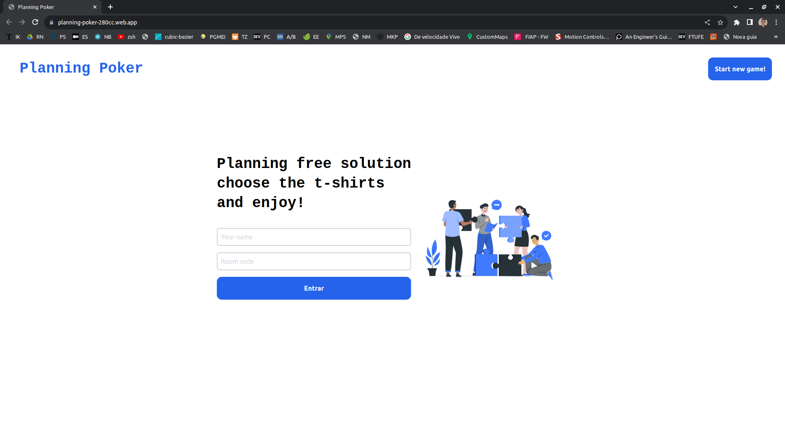
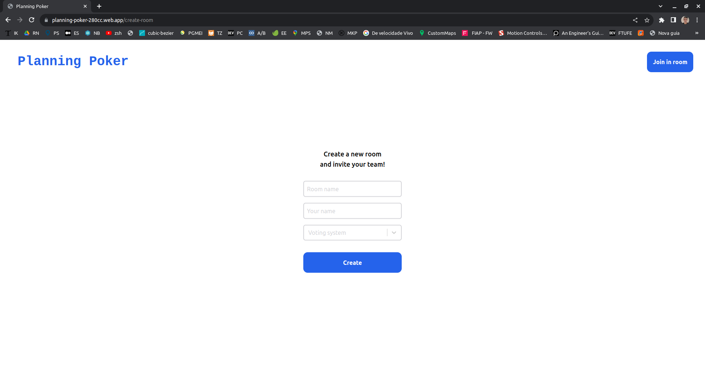
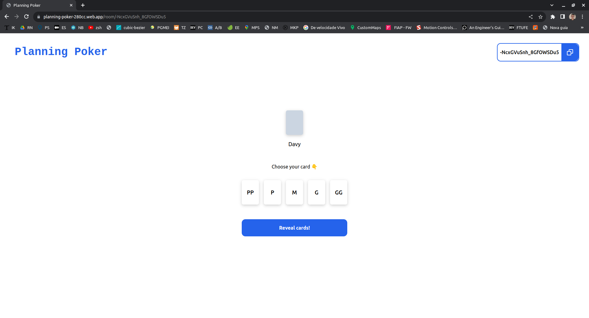
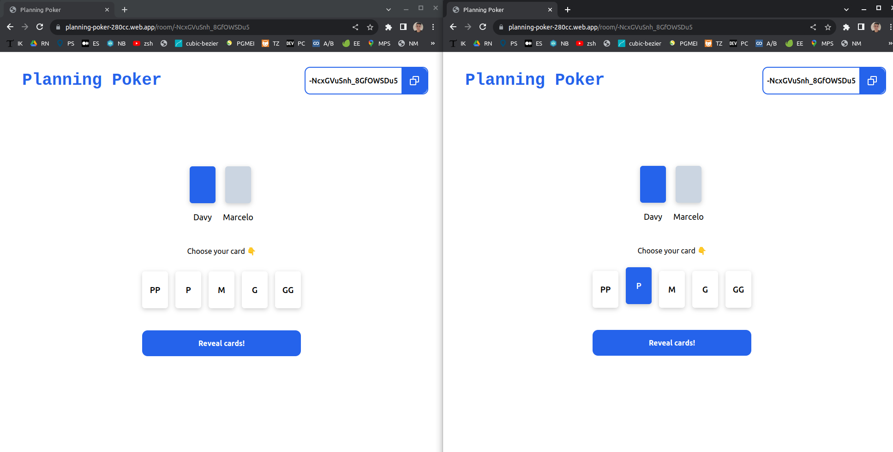
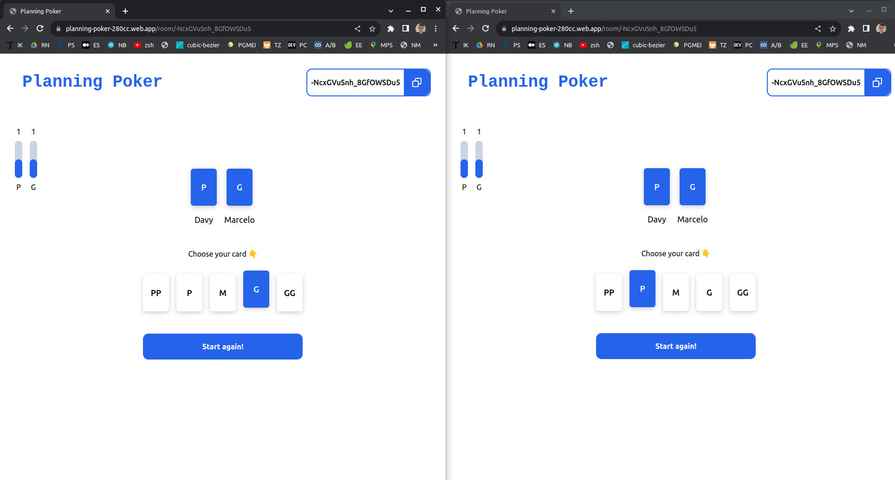

# PLANNING POKER ⚔️

 <br/>

<details>
  <summary>More images</summary><br/>
     
  <br/>
  <br/>
    <br/>
    <br/>
</details>


<details>
  <summary>What is Planning Poker?</summary>
  <br/>
  Planning poker, also called Scrum poker, is a gamified technique for estimating tasks mostly used by Agile development teams.

The game consists in looping through these steps for each task that the team wants to estimate:

## Step 1: Understanding Your Cards
[0; 1; 2; 3; 5; 8; 13; 21; 34; 55; 89; 100]

Each player is given the same number of cards with the same values. The objective is to vote for how much effort a particular project development task will require.

## Step 2: Story Reading
The Scrum Master (Project Manager) will present a story to the group.

## Step 3: Development Discussion
This is where each team member will give more details on the important aspects about the task.

## Step 4: Estimate and Share
All agile development team members will then choose a card from their deck to represent their estimate of story points. Once everyone has made their decision, all cards will be revealed. The higher the count, the more complex the particular project aspect will be.

## Step 5: Come to a Consensus
If all members reveal the same card, that number becomes the consensus – and the team can move on to the next story. If card values differ, further discussion with persuasive reasoning will be needed to determine why individual values were chosen. This process is repeated until a consensus is reached.
</details>

## 🏠 Project Architecture

- [x] Clean Architecture

## ✨ Technologies

- [x] Firebase
- [x] Realtime Database
- [x] Typescript
- [x] React
- [x] Tailwind css
- [x] Clsx

## 🧪 Next features

- [ ] Round history
- [ ] Logout 
- [ ] Toasts
- [ ] User account
- [ ] Improve UI/UX
- [ ] ...

## 🚀 Getting started


```bash
# config env

REACT_APP_API_KEY=
REACT_APP_AUTH_DOMAIN=
REACT_APP_PROJECT_ID=
REACT_APP_STORAGE_BUCKET=
REACT_APP_MESSAGING_SENDER_ID=
REACT_APP_APP_ID=
REACT_APP_MEASUREMENT_ID=
REACT_APP_DATABASE_URL=

```


```bash
# Install the dependencies
$ yarn

# Start the project
$ yarn start
```

</br>

---
<p align="center">Made with ❤️ by Davy de Souza</p>
